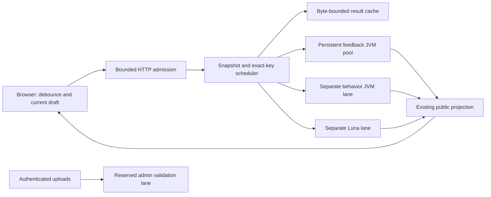

# Backend performance and traffic boundaries: specification first

Specification version: 1, 2026-10-03. Baseline source:
`e75b20419f8f92c2adc59ce083008ec897434cb1` (v0.0.3-alpha).

**Production specification; implementation is pending.** Separate constructive
models now live in [TB01](../formal/traffic/README.md), with a
[proof and implementation handoff](traffic-proof-handoff.md). This specification
does not itself assert a successful proof run. The
[obligation register](../closure/traffic-obligations.json) is
`SPECIFIED_NOT_VERIFIED`; every end-to-end obligation is OPEN. It is a candidate
for full implementation verification, not a closure report. Existing
[formal claims and limitations](implementation-bridges.md) remain unchanged.

The objective is to reduce work caused by repeated visits and edits, especially
JVM startup, while preserving the application's analysis and educational logic.
Use a bounded pool of persistent, isolated JVMs; combine simultaneous requests
for identical work; avoid obsolete downstream work. Prove the scheduler and
reuse obligations before promoting that design into the production pipeline.

## 1. Observed baseline and cost model

These are source-audit findings, not latency measurements:

| Current path | Work and limitation |
| --- | --- |
| Live page visit | Catalogue GET, detail GET, feedback after 200 ms, then behavior and explanation for a compiled draft: normally five application requests, excluding assets. |
| Live editing | 650 ms debounce. Pauses longer than that can each start work; unchanged manual checks can overlap. Browser abort suppresses rendering, but does not cancel the server's child process. |
| Feedback cache miss | `Portal.evaluate` launches `live.LiveFeedback` in a fresh JVM. Both metrics prepare every correct reference for that request. |
| Behavioral cache miss | A second fresh JVM runs `live.BehaviorFeedback`. Thus an uncached compiled edit normally launches two JVMs. |
| Explanation | `/api/explain` calls `evaluate` again. Usually a cache hit; eviction or an overlapping miss can cause another JVM. Luna has a separate result cache and concurrency limit. |
| Existing limits | Four feedback slots by default, one behavioral slot, two explanation slots; 128 feedback and 32 behavior cache entries. No shared in-flight computation. |
| Public GETs | Catalogue projections are reconstructed; assets are read again; all responses use `no-store`. IIS also disables static caching and ETags. |
| SQLite | One validated in-memory snapshot is loaded at startup and replaced after an admin publication. SQLite is not queried on every visit or edit. |
| HTTP admission | `ThreadingHTTPServer` can create threads before the analysis semaphores. Public body reads have a five-second inactivity timeout, not an absolute request deadline. Public framing checks are weaker than the existing admin checks. |

Audit anchors: [server.py](../server.py), `Portal.evaluate`,
`Portal.evaluate_behavior`, `Handler.do_GET/do_POST/reply`;
[runtime_dependencies.py](../runtime_dependencies.py), `run_engine`;
[web/app.js](../web/app.js), `selectExercise`, `scheduleFeedback`, `checkPredicate`,
`requestBehavior`; [LiveFeedback.java](../engine/src/live/LiveFeedback.java),
[AstFeedback.java](../engine/src/live/AstFeedback.java),
[luna.py](../luna.py), `Explainer`; [admin_service.py](../admin_service.py),
`commit`; [IIS configuration](../deploy/iis/web.config).

Measure startup, queue wait, learner parsing, reference preparation, comparison,
trace/location projection, behavior solving and serialization separately.
The design predicts fewer launches and duplicate jobs; it does not yet establish
a speedup or a particular millisecond response time.

## 2. Unchanged application contract

An admitted successful request must retain these properties:

1. Canonical remains the default. Canonical and raw AST Zhang–Shasha retain
   their respective distance, costs, trace order, tie behavior, diagnostics,
   learner canonical display, exact occurrence locations and public schema.
2. Each metric selects its nearest member of the **complete ordered correct
   pool, including every oracle**. Preserve first-minimum ties. Do not stop at
   zero, prune candidates heuristically, compare only to the oracle, or return
   a partial pool result. A bad later candidate must still invalidate the pool.
3. The environment, predicate identity and exact learner text remain unchanged.
   Whitespace/comment normalization cannot identify requests whose source
   coordinates differ. No learner source or reference code is rewritten to
   make persistence easier.
4. Behavioral scoring keeps the same primary oracle, facts, scope, bitwidth,
   sequence/trace bounds, sampling procedure, rounding to 0.001, four categories,
   and up to three witnesses per category. Categories, not distance, determine
   witness meaning. Metric switching alone does not require a new behavior job.
5. Luna still describes each atomic operation and each displayed instance,
   followed by a short summary. Preserve guidance without exposing target
   expressions or full solutions; keep existing optional/unavailable behavior.
6. Keep strict stale-response guards, revision-specific delivery, draft/history
   behavior, admin authentication, equivalence validation, atomic publication,
   SQL boundaries and private configuration. Nothing becomes a CDN-cacheable
   learner result or an unauthenticated admin operation.

Resource rejection, retry metadata, conditional public GETs and cancellation of
obsolete work are permitted transport/scheduling changes. They must be explicit,
bounded and tested; they cannot silently change a computed answer or turn an
analysis failure into success. For accepted inputs that finish within the same
budgets, compare the one-shot and persistent implementations' public results.
Do not claim identical latency, availability under overload, or identical LLM
wording as part of computational equivalence.

## 3. Architecture and rollout units

**R1 — admission and duplicate suppression.** Add measurements, strict shared
HTTP framing, bounded admission, snapshot identity, exact-key caches and shared
in-flight jobs. Keep the one-shot engine as the executable baseline. Prove the
pure scheduling policies and specify their runtime mappings before integration.

**R2 — persistent workers.** Replace per-edit process startup with fixed pools,
one active request per JVM. Invoke the existing evaluator on fresh request data;
do not simultaneously change algorithms or cache parsed references. Feedback and
behavior have separate lanes. Admin validation may remain one-shot, but must
share the total process/resource budget. No fallback may spawn outside that
budget. Prewarming and recycling are server lifecycle events, not edit events.

**R3 — prepared references, separately gated.** Only after worker isolation is
established, reuse immutable or independently cloned reference representations.
Bind them to the full environment, ordered pool and algorithm identity. Reusing
preparation does not remove any candidate from the comparison. If mutable state
or parser ownership cannot be shown safe, defer this optimization; persistent
workers and request coalescing remain useful without it.

**R4 — visit and downstream reuse.** Pre-serialize public catalogue/detail views;
use revalidation and content-versioned static assets. Reuse behavior across
metric changes and navigation while its exact context remains resident. Reuse
approved structural evidence for explanations without launching another analysis
solely to reconstruct that evidence. Preserve automatic feedback and guidance.

Serve content-fingerprinted assets with immutable caching; revalidate HTML and
public catalogue/details against their generation. Keep Cloudflare bypass rules
for `/api/*`, `/admin/*` and private responses; browser/origin conditional GETs
can still save transfer and serialization work. An ETag must describe the exact
public projection, never a private oracle digest exposed as a new public field.
Test fresh publication and version upgrades with browser, IIS and CDN caching
enabled, so the earlier stale-site problem is not reintroduced.

Each unit needs the relevant obligations and regression gates before rollout.
Keep an operator-selectable one-shot mode under the same admission controls for
diagnosis/rollback. Do not silently retry a timed-out analysis with another
engine or enlarge its budget. Version the backend, worker protocol and frontend
compatibly and ship them together in Linux/macOS and IIS builds.

## 4. Identity, sharing and immutable snapshots

Capture one immutable validated snapshot at admission. Record, environment,
predicate, ordered pool, primary oracle and policies must all come from it.
Current imports are append-only and reject duplicate IDs; no present stale
replacement defect is claimed. Explicit generations are required for reliable
future reloads and to prevent mixed reads during publication.

The **computation key** contains the service instance, snapshot identity,
exercise identity, exact raw UTF-8 body, analysis kind, engine/dependency/rules
fingerprint and relevant bounds/policy version. Include the metric for structural
analysis and trace explanations; omit it only for metric-independent behavior.
Use structured, length-delimited encodings. A digest is an index: retain and
compare the underlying identity before reuse, or explicitly register hash
collision resistance as trust. Never assume injective hashing in Lean.

The **delivery identity** additionally contains a server-issued editing-channel
capability, subscriber ID, selection, revision and metric. Caller revisions are
not authorization or globally unique identities. A bounded, expiring channel is
scoped to one tab; possession authorizes cancellation of that channel's own
subscribers only. Cap channels globally as well as per source; generating new
identities must not bypass global admission. Do not change learner login policy.

One scheduler lock or one serial event loop atomically owns cache lookup,
in-flight lookup, job insertion and reservations. At most one queued/running
computation for an exact key may exist. Identical callers join it within bounded
subscriber counts/bytes; each response receives that caller's delivery identity.
No shared mutable response dictionary may acquire a caller's revision or token.

Only the latest *queued* structural request for a channel is retained. Replacing
it detaches that subscriber, not other subscribers to the old shared job. Queue
replacement keeps the channel's turn in a bounded round-robin order. A running
obsolete job either finishes without publishing to that subscriber or follows
the explicit cancellation protocol below. Suppress obsolete behavior/Luna stages
after the scheduler accepts supersession/cancellation. A browser edit is not
instantaneously visible to the server: work dispatched before that notification
may finish, but the browser's guards immediately prevent obsolete display.
Debounce stays 650 ms and initial checking stays 200 ms unless separately agreed;
manual checks remain immediate and join identical work. No new artificial
debounce delay is needed to obtain process reuse.

Turning Live off cancels an unexpired debounce; it does not retroactively change
the semantics of an already-admitted check. Preserve its ability to finish and
produce its normal stages while the draft remains current. Manual Check still
works with Live off. Any subsequent edit/selection invalidates display and, once
observed by the scheduler, suppresses obsolete queued/downstream subscriptions.

Cache keys cover successes and any short-lived deterministic syntax/type errors.
Never cache overload, transient timeout, crash or provider/authentication failure
as a successful analysis. Bound entry count, serialized bytes, retained object
size budget, lifetime and all in-flight subscriber/result retention. Eviction
may reduce reuse but must not invalidate a still-admitted subscriber's evidence:
pin it with accounted bytes until that subscriber finishes, or return an explicit
expiry. A Luna evidence token must bind the exact structural/behavioral evidence,
snapshot and explanation policy; it must not expose private references.

An old snapshot may finish for its still-current subscribers against that pinned
snapshot, but cannot populate a new generation's cache or masquerade as its
response. A browser refresh that adopts a new generation invalidates old delivery
identities. Retained generations and their reference state are byte/count bounded.

## 5. Persistent JVM lifecycle and protocol

`LiveFeedback.main` is currently a **one-request, EOF-terminated protocol**, and
replaces global stdout/stderr to prevent leakage. Repeatedly invoking `main` or
writing multiple JSON values into its stdin is not a worker protocol.

Specify a new private dispatcher, separate from the existing one-shot entry
point: versioned length-prefixed UTF-8 JSON frames, exact field/tag validation,
server-generated job ID, monotonically unique worker incarnation, snapshot/key
identity, analysis kind and response schema version. Check a frame's announced
length before allocation. Read only bounded chunks against an absolute deadline.
Only the protocol writer owns stdout; no parser, solver or diagnostic text can
enter frames. Stderr is drained with a fixed cap and sanitized/limited retention.
The dispatcher is not a network listener. Construct its launch environment from
an explicit minimal allowlist; pass no OpenAI/admin secrets through environment,
arguments, frames or working files. The current `clean_java_environment` removes
Java option overrides but otherwise inherits the parent environment, so this
boundary requires a change. It is not a complete sandbox: a child under the same
OS account may still access private files unless permissions/containment prevent
it. Account isolation and the filesystem access model belong to explicit trust.

Each worker follows `Starting → Idle → Busy → Idle`, or
`Starting/Idle/Busy → Stopping → Reaped`. A worker record reserves a process slot
**before** launch and retains it throughout stopping. A replacement can start
only after positive OS exit/reaping acknowledgement of the old incarnation.
A cancel message, closed socket, timeout, signal sent, or expired lease is not
proof of exit. Failure to reap consumes capacity and produces a sanitized
unavailable condition; never oversubscribe to recover availability.

Request tickets are unique within an incarnation and cannot be reused. Accept
one terminal result only for the current busy ticket and expected full identity.
Late frames, duplicate completion, unexpected stdout, oversized/truncated frames,
protocol mismatch, crash, timeout or fatal JVM errors retire the worker. Existing
evaluators catch `Throwable` in some paths: a valid-looking error response must
not hide a poisoned VM (`OutOfMemoryError`, linkage/native failure, etc.). Audit
and classify this boundary before reuse; do not change normal analysis results.

No concurrent evaluations inside a JVM. Audit static counters/caches, solver
handles, parser object ownership, streams, thread locals, locale/random seeds,
temporary paths and prepared-object mutation. Fresh mutable request state and
resource cleanup are mandatory. Give each worker a private directory under an
owned `build/`/runtime scratch root and each job its own subdirectory. Clean only
owned directories after their users exit; never dump artifacts into shared `/tmp`.
For live workers, preserve owned temporary-file isolation through an explicitly
audited adapter; the current launcher supplies a directory per JVM. Changing
`java.io.tmpdir` at each job is not sufficient: Java may cache it internally.

Read-only inspection of the bundled `alloy.jar` bytecode establishes a concrete
reuse cost: `CompUtil.parseEverything_fromString` calls `flushModelToFile`, which
creates `alloy_heredoc*.als` and registers `deleteOnExit()`. A long-lived process
retains those registrations even if files are manually removed. R2 must either
use an equivalent bounded owned-file parser adapter without that registration,
or cap parser invocations/temporary bytes per worker and recycle before the
limit. Charge reference parses as well as learner parses; a job can parse an
entire pool. File cleanup alone does not bound the JVM registry. Adapter changes
need source-location/diagnostic equivalence tests and a TRF-11/17 mapping.

The graph implementation also has process-wide identity counters and a
thread-local arena (`CanDis/core/EGraphNode.java`, `CanDis/core/NormalForm.java`).
`CanDis/ir/IRAgent.java` already calls `beginGraph/endGraph`; do not assume cleanup
is absent. Qualify exceptional cleanup paths and preserve identity uniqueness
while retained graphs exist. Do not blindly reset counters. Canonical prepared
values contain mutable graph/provenance objects despite an unmodifiable outer
list, and AST preparations retain parser nodes. Deep immutability is an OPEN
TRF-10 obligation. The current behavioral solver explicitly uses SAT4J; no native
SAT leak has been demonstrated. Qualify solution/enumerator lifetime separately
before warming that lane.

Cap task count, age and whole-process memory; recycle only through the same
stop/reap lifecycle. `-Xmx` is not an RSS/native solver bound. Use deployment OS
process containment where available and account for its platform-specific trust.
Rate-limit restarts and use a circuit breaker for repeated startup failure.
No forever retry loop, unbounded pending replacement list or unbounded cleanup
queue is permitted. Shutdown stops admission, detaches subscribers, drains for a
fixed budget, then kills/reaps owned workers and reports any unreaped process.

## 6. Inbound boundaries and measurable budgets

Limits cover **all routes**, including cache hits, GET/static/health/dashboard,
admin uploads and disabled/unavailable explanation requests. Apply a bounded
connection/handler gate before creating request threads or buffering headers;
the current JVM semaphores are too late. Reject cheaply or close without creating
a second unbounded queue. Route identity is unknown before bounded header parsing,
so a route-name reservation alone cannot protect diagnostic admission. The
candidate profile uses 30 public handlers and two on a **separate loopback-only
control listener**, with separate nonborrowable rate credits within the combined
budget. Its address is operator-configured per deployment/site, never exposed
through IIS/Cloudflare. The ordinary public `/api/health` remains under public
admission and may reject under load; the private control path has no Alloy job,
secret content or administrative mutation. No unconditional health response-time
guarantee is made. Both listeners, their backlogs and retained bytes are counted.

Reject ambiguous HTTP framing before reading a body: multiple Content-Length
headers, Transfer-Encoding, unsupported content encoding, malformed lengths,
unexpected request fields/duplicate JSON keys and invalid UTF-8. Bound headers,
request line, number of headers, body bytes, nesting, read buffers and response
buffers. Apply absolute header/body/write deadlines as well as idle timeouts;
check a monotonic clock after each bounded read. GET is not a bypass for oversized
headers/bodies. Reuse the stricter admin parser contract without weakening its
authentication, CSRF, limits or error redaction.

The candidate configuration below fixes a **small validation profile**, not
measured production capacity. Final deployment defaults require an accepted
baseline and memory measurements. No value is an advertised latency promise.

| Budget | Candidate validation profile / preservation rule |
| --- | --- |
| Accepted handlers | 30 public plus 2 separate loopback control, 32 combined; bound both socket backlogs separately. |
| Feedback / behavior / admin JVMs | 2 / 1 / 1; at most 4 live-or-starting-or-stopping JVM reservations in total, including replacements and one-shot validation. |
| Queued jobs | 8 feedback, 2 behavior, 1 admin; latest queued subscription per editing channel. |
| Subscribers/channels | 16 subscribers per shared job, 128 globally; 64 live channels, with expiry and a bounded creation rate. |
| Explanation work | 2 active, 4 queued; bounded shared evidence and provider requests; no credentials in worker payloads. |
| Public body limits | Preserve 8 KiB learner body and 16 KiB public JSON request limits; retain existing separately bounded admin upload limits. |
| Header/body deadlines | Candidate 5 s each, absolute; idle timeout cannot extend them. Worker deadlines retain 12 s feedback / at least 30 s behavior with current configuration semantics. |
| IPC | Baseline input limit is 1 MiB; define explicit request, pool-load, feedback, behavior and stderr limits before implementation. Stream-enforce the existing 4 MiB behavior output limit. |
| Cache/preparation memory | Separate positive byte and entry caps for public projections, structural results, behavior, Luna, pinned evidence, snapshots and per-worker prepared references. Calibrate against all 181 exercises; an entry too large for caching is returned without caching if its output is admissible. |
| Rate/retry | Combined admission envelope: burst 64, 32 tokens/s, split into nonborrowable public 60/30 and private control 4/2 buckets. Charge every admitted HTTP request; expensive work additionally consumes lane capacity. Browser auto-retry at most twice for eligible capacity rejection, with jitter and Retry-After; newer edits cancel it. |

All unspecified numeric byte/age/RSS limits are **OPEN configuration inputs**,
not infinity or implementation discretion. Freeze their values, units, arithmetic
and provenance in the executable profile before its proof/implementation bridge
can pass. Validate configuration relationships, including nonzero health reserve,
queue/subscriber accounting and total processes. Do not ship a new cap that
silently excludes previously admitted catalogue fixtures without an explicit
compatibility decision. Prefer bypassing an optional cache to changing logic.

Global caps are authoritative. Optional per-source limits use the actual peer
unless a configured trusted proxy supplies a validated forwarding chain. Origin
and client revision are not identity credentials. Behind Cloudflare → IIS, keep
the backend private/loopback, scope settings to the intended IIS site, and trust
forwarded addresses only from configured peers. Direct spoofed headers must not
change quota identity. Per-IP fairness is best-effort for shared NAT; do not claim
Sybil resistance or network-level DDoS immunity. IIS/CDN buffering, socket backlog,
TLS and OS packet queues require separately bounded deployment configuration.
The combined caps describe one Alloy Studio service instance. On a shared IIS
host, allocate host memory/CPU/process budgets across all sites; separate service
instances do not automatically share this scheduler's reservations. Traffic
proofs for one instance do not bound unrelated websites or other host processes.

Use 429 for a source/rate limit and 503 for global capacity, with bounded
Retry-After and sanitized JSON; update frontend handling in the same rollout.
Maintain distinct invalid/unsupported/timeout/error results. Worker queue wait
has its own deadline and must not silently enlarge the engine's execution budget.
Automatic retries apply only to explicit 429/503 admission rejections that
guarantee work was not dispatched, for learner feedback/behavior/explanation.
Do not automatically retry invalid/unsupported results, analysis timeouts, auth
failures, provider calls with unknown outcomes or administrator mutations. Preserve
the original exact draft/evidence identity and absolute operation deadline across
eligible retries; publication with a lost reply requires status reconciliation.
Retries acquire new admission credits; followers are accounted even when no new
JVM job is needed. A slow response reader cannot retain unlimited results or
worker capacity. Release CPU occupancy on completion, retain counted delivery
bytes only until the write deadline, and evict/close safely afterward.

## 7. Lean obligations: definitions before proofs

Define a finite-map transition system, not counters disconnected from real jobs:
`State = {connections, channels, subscribers, jobs, workers, cache, snapshots,
byteReservations, buckets, now}`. Each resource has an owner and unique ticket;
counts/bytes are derived from those owned objects. Events include admission,
decode rejection, join, enqueue, supersede, dispatch, frame arrival, completion,
disconnect, cancellation request, deadline, process exit, publication, eviction,
retry and shutdown. `Reachable initial s` is the reflexive transitive closure of
the guarded transition relation. Initialize all occupied collections empty.

Define the unchanged one-shot observation independently of the optimized
scheduler. Define exactly what is observable: projected result fields and order,
locations, metric, pool completeness, diagnostic status, behavior categories,
rounded score and evidence identity. Delivery metadata and timing are separate.
Do not put the desired invariant or answer equality into a structure field and
then present projection of that field as the proof.

The following are **end-to-end target statements**. TB01's exact supporting
declarations and narrower model claims are listed in its own frozen inventory;
the names below are not promises of completed production proofs. Implementations
and full correspondence remain OPEN in the register.

| ID | Planned theorem / obligation | Required conclusion |
| --- | --- | --- |
| TRF-00 | `profile_wellFormed` | Frozen positive finite budgets and encodings determine a unique initial state and admissible configuration. |
| TRF-01 | `admitted_is_validated` | Only strictly decoded, size/deadline-admissible inputs enter a lane; header/connection accounting precedes handler allocation. |
| TRF-02 | `admissions_le_budget` | Charged admissions over a monotone logical-time interval do not exceed initial credit plus refill; rejected/retried/cache-hit requests cannot mint credit. |
| TRF-03 | `reachable_resource_bounds` | Every reachable state respects connection, job, queue, subscriber, channel, retained-generation and byte reservations; no double ownership or underflow. |
| TRF-04 | `one_computation_per_key` | At most one queued/running computation exists per complete key; lookup/reserve/join is atomic. |
| TRF-05 | `superseded_not_dispatched` | Detached queued subscriptions cannot dispatch alone; cancelling A cannot revoke B; bounded round-robin state keeps replacement from resetting A's place. |
| TRF-06 | `release_requires_terminal_owner` | Capacity releases once, by its owner, and live process reservations remain until the matching incarnation is reaped. |
| TRF-07 | `accepted_frame_matches_ticket` | A bounded complete frame can finish only the current worker ticket, at most once; stale/incarnation-mismatched frames cannot publish. |
| TRF-08 | `reuse_key_preserves_context` | Reuse implies exact raw text, environment, ordered pool, engine, kind/metric, bounds and captured snapshot agreement. |
| TRF-09 | `cache_and_join_observation` | Cache hits/joined callers preserve one-shot public observations and independently attach the correct subscriber identity. |
| TRF-10 | `prepared_pool_preserves_scan` | Optional prepared reuse equals fresh preparation and retains every candidate, first-minimum selection and failure behavior. |
| TRF-11 | `warm_worker_history_independent` | For each admitted history reaching an idle reusable worker, the next observation equals fresh execution on the same explicit inputs. |
| TRF-12 | `behavior_reuse_preserves_evidence` | Reuse preserves score/category/witness meanings and facts/bounds; metric-only switches do not alter behavior identity. |
| TRF-13 | `publish_only_current_delivery` | A rendered result matches selection, exact body, revision, metric and generation; after server-observed supersession no obsolete downstream stage dispatches. |
| TRF-14 | `explanation_evidence_binding` | Luna requests reuse only approved evidence for the same trace/instances and credential-policy scope; no new structural solve is needed for pinned evidence. |
| TRF-15 | `public_projection_preserved` | Output values equal the independently defined approved projection, with explicit permitted operator disclosure and bounded sanitized transport/diagnostic/telemetry values; field allowlists alone are insufficient. |
| TRF-16 | `terminal_and_retry_bounded` | Logical deadlines, retries, restarts and shutdown retain resource safety, unique terminal outcomes and no post-deadline dispatch/publication. |
| TRF-17 | `backend_step_refines_model` | Each concrete Python/Java lifecycle transition maps uniquely to the specified atomic event; reservations and OS acknowledgements have explicit interpretations. |
| TRF-18 | `wire_and_browser_refinement` | Concrete decoders, exact-key construction, proxy identity and browser guard capture correspond to their modeled values and transitions. |
| TRF-19 | Differential regression evidence | Both metrics, behavior and redaction retain admitted baseline behavior across the 181 invariants and adversarial request histories. TESTED, not an all-input theorem. |
| TRF-20 | Traffic/performance evidence | Finite visit/edit/overload workloads meet the frozen counts, launch, memory and responsiveness acceptance criteria. TESTED, not a Lean latency theorem. |
| TRF-21 | Deployment evidence | Linux, macOS and Windows/IIS enforce the intended process, timeout, scratch, proxy and packaging contract. Platform support/trust is explicit. |
| TRF-22 | Proof and provenance gate | Offline kernel checking, empty axiom audit, two clean builds, frozen inputs/verifiers and mechanically unique bridge inventory; unresolved items cannot pass. |

For example, prove resource safety in the shape
`Reachable initial s → occupiedProcesses s ≤ profile.totalProcesses` by
induction over *all* events, including crash, timeout and shutdown. Prove
`dispatch s job = some s' → validated job ∧ currentSubscribers s job ≠ []`.
Define warm-worker equivalence over an independently specified evaluator state;
do not assume `evaluateWarm = evaluateFresh` as a premise. Where Alloy/JVM
semantics cannot yet be formalized, keep TRF-11/17 OPEN and label differential
checks TESTED. A safety theorem about abstract counters alone is insufficient.

Model rate refill using integer/fixed-point monotone time, including saturation,
elapsed-time rounding, backwards-clock rejection and arithmetic overflow rules.
Prove logical deadline safety, **not** that an OS will schedule a timer promptly
or terminate a process. No unconditional liveness claim is made: an unreapable
worker, absent provider or infinitely hostile workload cannot guarantee an answer.
If later claiming fairness or bounded waiting, name worker termination and
scheduling premises explicitly instead of treating them as established facts.

## 8. Constructed adversarial traces to formalize

These finite traces are design witnesses, not executed regression results. Each
must become a frozen machine-readable witness and an executable negative test.

| Witness | Concrete breach in a naive design | Required rejection / obligation |
| --- | --- | --- |
| W01 | Capacity 1; threads A/B both observe free=1, then both launch. | Atomic reserve; TRF-03/04/17. |
| W02 | Capacity 1; A runs, cancel releases its permit, B starts before A exits: 2 live JVMs. | Reap-bound reservation; TRF-06. |
| W03 | Identical K, revisions 4 and 9; A cancels and kills their shared job although B still needs it. | Subscriber-owned cancellation; TRF-05/09. |
| W04 | `some A` versus `  some A` share a normalized key and return the first string's location. | Exact bytes in K; TRF-08/09. |
| W05 | Exercise E changes pool P0→P1 while work on P0 runs; a key omitting generation inserts it as P1. | Pinned snapshots and namespaces; TRF-08/13. |
| W06 | Ticket 7 times out; replacement reuses 7; late old frame is accepted for the new worker. | Incarnation plus unique ticket; TRF-07. |
| W07 | Client sends a byte every 4 s under a 5 s idle timeout and never finishes. | Absolute header/body deadline and bounded handler reservation; TRF-01/03/16. |
| W08 | New channel for each of 10,000 requests defeats per-channel queue limit 1. | Global channel/job/byte caps; TRF-02/03. |
| W09 | Worker announces a 2^32−1 byte frame; decoder allocates it before checking the cap. | Check prefix before allocation; TRF-07/18. |
| W10 | First pool member has distance 0; second is malformed; warm cache stops early and reports success. | Complete validation and scan; TRF-10. |
| W11 | `/api/explain` arrives after cache eviction and starts a second solve for evidence already admitted to the explanation. | Accounted evidence pin; TRF-14. |
| W12 | `OutOfMemoryError` is caught and returned as ordinary unsupported, then the same worker is reused. | Fatal-error classification/retirement; TRF-11/17. |
| W13 | Two Content-Length headers disagree, or forwarding headers change on a direct connection to select fresh quota identities. | Strict decoder and trusted-peer policy; TRF-01/18. |
| W14 | Every edit aborts/kills its JVM, then prewarming launches a replacement: persistent mode still launches once per edit. | Default obsolete-job completion/reuse; bounded recycling and measured launch gate; TRF-06/20. |
| W15 | Public connections occupy every pre-header slot or spend every shared rate credit; two nominal health slots cannot admit a diagnostic request. | Separately bounded private ingress and nonborrowable credits within the total envelope; TRF-01/02/03/21. |
| W16 | Hidden reference text appears in the existing allowed `diagnostics[0].message`; field checks pass. | Value-level approved projection and sanitized diagnostics; TRF-07/15/17. |
| W17 | Backend environment contains `OPENAI_API_KEY=K`; filtering only Java options leaves K in the worker environment. | Minimal launch-environment allowlist; TRF-15/17/21. |
| W18 | Browser edits at t0, old behavior dispatches at t1, supersession reaches the scheduler at t2. | No dispatch guarantee starts at t2; browser rejects obsolete display from t0; TRF-05/13/18. |

For history independence, freeze real minimal A/B/A request sequences spanning
different exercises, metrics and parser failures; do not invent a static-state
bug without a reproducer. An invariant-breach review must provide the exact
initial state, events/input and violated postcondition, not just a suspicion.

## 9. Acceptance workloads and evidence

Use fake workers/provider first, then bounded real-engine runs in owned scratch.
Record request count separately from computation count, JVM launch count,
provider calls, coalesced subscribers, obsolete jobs, queue depth/wait, retained
bytes, process RSS, peak process count, restarts, p50/p95 latency and time from
the final edit to its visible result. Log bounded IDs/counters, never source,
reference text, credentials, cookies or unbounded per-draft metric labels.

| Workload | Required acceptance observation |
| --- | --- |
| Cold valid visit | One structural and at most one behavior computation; at most one enabled explanation; explanation starts no duplicate structural computation. |
| 20 edits, 100 ms apart | Starting with prior work drained and controlled transport, one final debounced feedback request; no obsolete behavior/provider stage. |
| 10 edits, 700 ms apart, slow worker | Bounded latest queued subscription per channel; final draft displayed; obsolete queued work does not grow with edit count. |
| 20 simultaneous identical checks | One in-flight computation; accept/join only within subscriber caps and explicitly reject excess. |
| Two callers join; one cancels | Remaining caller still receives its own correctly bound result. |
| All subscribers cancel before dispatch | Zero engine executions for that job; all reservations released once. |
| Canonical→AST→Canonical | At most one structural computation per resident key/metric; no extra behavior solve solely from the metric switch. |
| Live off before debounce / during a check | No timer-initiated job in the first case; an already-admitted check may finish under normal current-draft guards; manual Check still works. |
| A→B→A / repeated visits | Exact drafts retained; cache/revalidation prevents redundant resident work and unchanged public payload retransmission. |
| 100 distinct valid sequential edits after prewarm | With a pre-frozen memory/parse/task budget permitting this workload and no injected faults, **zero additional JVM launches**. Do not enlarge thresholds after failure; report solver jobs separately. This is the primary launch acceptance gate. |
| Restart/timeout/cancel storm | Peak process count never exceeds total budget, including stopping and starting incarnations; bounded restarts; no stale result. |
| Slow headers/body/readers, malformed frames | Bounded handlers and buffers, absolute expiry, sanitized rejection; no analysis dispatch for rejected input. |
| Saturated public ingress and rate bucket | Independent loopback control admission stays within its own cap/credits; combined budgets never exceed the profile. |
| Admin publication during analysis | A request observes one snapshot; subsequent catalogue validation discovers publication; old results cannot impersonate new generation. |
| 32 virtual clients for 30 s, fake work | All configured reservations/count/byte limits hold; rejections/retries bounded; no growing retained state after drain. |
| Warm versus fresh across all 181 invariants | Both metrics, starters, fixed incorrect/correct samples, invalid syntax/types, tied/late-invalid pools, repeated terms, CRLF/Unicode and cross-exercise A/B/A histories preserve observations. Include explicit empty-body handling. |

For behavior, first establish whether fresh runs deterministically enumerate the
same witnesses. If they do, compare exact public results. Otherwise freeze the
permitted nondeterminism before testing: keep the same sampling algorithm,
bounds and scoring definition; verify each witness's category and structure
using Alloy, up-to-three limits and token-to-displayed-instance correspondence.
Investigate changed score/sample sequences; do not broadly ignore differences
as solver nondeterminism. Reusing one already valid observation is distinct from
changing the sampling algorithm. Use a fake Luna provider to test evidence and
call counts; no paid full-corpus calls are required.

For fair performance measurements, freeze machine/OS/JDK/Python, input snapshots,
thread/CPU/heap/RSS limits, active lanes, timeouts and cache/preparation state.
Compare cold, warm and repeated-request workloads separately. Main gates are
launch/computation reduction and bounded resources. Set numerical p95/UX targets
after the baseline is measured, before running the candidate; never use an
unsupported/error exit as a successful fast response. The earlier unequal-worker
batch benchmark is not the baseline for this web refactor.

## 10. Proof execution, implementation bridges and completion

Specification comes first. Next freeze the finite model, theorem inventory,
independent definitions, witnesses, byte-limit profile and trust before proofs.
Keep new traffic blocks separate from existing B01/B03 inventories until an
explicit new frozen block and registry exist; no incidental barrel edits.

Use the installed pinned Lean toolchain through the existing offline isolation
wrapper. No network, package download, `sorry`, `admit`, introduced axioms,
native unchecked proof evaluation or unlisted assumptions. Audit the complete
transitive axiom dependencies of every declared theorem. Establish invariants
from the concrete initial state and transition definitions. State environmental
trust and any conditional claim openly; do not claim assumption-free application
correctness. Run two isolated clean builds against identical frozen input hashes.

After each proof block, apply the requested adversarial ladder: **two GPT-6 Luna,
then two GPT-6 Sol, then two GPT-6 Astra reviews**. Every alleged breach needs a
constructed counterexample that can be mechanically checked. Review text can
propose repairs; it never discharges a theorem or correspondence obligation.
Model review occurs outside the network-isolated proof commands and requires no
internet research. Hash the reviewed candidate, preserve counterexamples, and
repeat the affected block's checks after changes.

Map scheduler events to concrete functions and lock boundaries, Java ticket/frame
handling, OS process observations, frontend guard captures and cache identities.
Prefer one small pure policy kernel with generated runtime policies and exhaustive
finite-domain correspondence where feasible. Boolean truth-table agreement does
not prove that locks, decoder comparisons or process handles supply the right
Booleans. These remain separate TRF-17/18 obligations. Differential tests alone
cannot promote them to a semantic refinement theorem.

The future closure package must freeze source/dependency/configuration hashes,
verifier implementations, theorem names, production mappings, witness files,
public claim provenance and evidence schemas. Missing/ambiguous mappings,
unbound results, unknown required limits or stale evidence block closure; an
infrastructure failure is reported separately. This specification supplies no
PASS results and changes no status of the original L00–L23 obligations.

Trust includes the declared Lean kernel/toolchain, verifier/extraction tooling,
Python/JVM/Alloy/SAT execution, OS process/clock/filesystem semantics, proxy/TLS
configuration and hardware where not refined further. Token generation and any
digest-only identity need explicit cryptographic trust. Lean can establish
state-machine safety and preservation under precise interpretations; it cannot
by itself establish RSS bounds, network availability, solver correctness,
provider prose quality or universal DoS immunity.

Completion requires separately reported **PROVED** model claims, **CHECKED**
bindings, **TESTED** behavior/load/platform results, **TRUSTED** dependencies and
**OPEN** implementation obligations. Deploy the optimization only after its
applicable preservation and resource gates pass. Full proof closure remains
unestablished while any required refinement obligation is OPEN.
