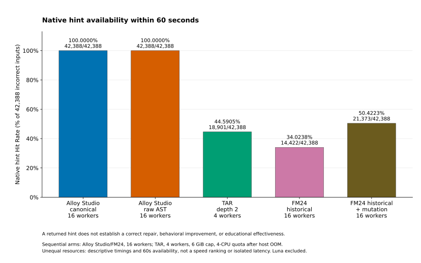
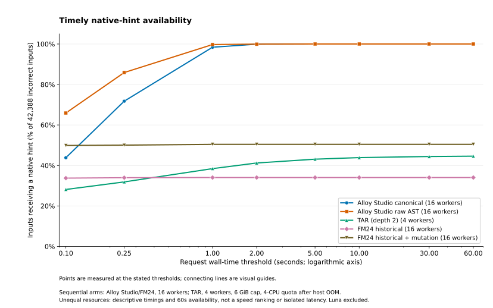

# Alloy4Fun hint-generation comparison

This study compares **both Alloy Studio modes—Canonical and raw AST
Zhang–Shasha—with TAR and the history-based FM24 approach**, using the requested
61,598-model ACGN cohort. It measures the actual deterministic hint engines.
GPT-6 Luna narration, HTTP/IIS/Cloudflare, browser rendering, and behavioral
instance enumeration are outside the timed workload. The benchmark makes no Luna
API requests.

**Pool-policy scope:** the measured run uses a benchmark-specific five-fold
holdout. This differs from `Alloy4FunAugmenter`, which includes all admitted
CORRECT submissions plus an oracle and ranks only incorrect submissions. The
reported nonempty hints on held-out CORRECT submissions are therefore not
failures to recognize members of the original complete correct pool. A complete
original-pool operational comparison has not been measured by these runs.

**Completed on 2026-09-30.** All five arms have 61,598 outcomes each:
**307,990 measured requests**, with no missing models. The final saved-response
correspondence audit passed for every arm. TAR and automatic finalization both
exited successfully; the previous valid results and interrupted archive remain
unchanged. [The evidence index](benchmarks/README.md) identifies the frozen
results, figures, provenance, completion records, and verification limits.

The [engine and corpus diagnostic report](hint-diagnostics.md) records
temporary-file failures, a canonical-display defect, and two incorrect corpus
labels found during validation. The renderer and temporary-file lifecycle were
corrected; the two legacy labels were explicitly overridden in the completed
rerun. Earlier outcomes remain preserved separately.

The experiment uses a **60-second deadline per request**.
The generated section below contains the final full-cohort measurements.
Pilot results and interrupted TAR rows are excluded.

<!-- BEGIN GENERATED BENCHMARK RESULTS -->

Measured cohort: **61,598 models**, including **42,388 incorrect inputs** and **19,210 held-out CORRECT submissions**. Each tool completed the same cohort with a 60-second hint-generation budget. Luna is excluded.

Native hint availability is distinct from a complete repair, semantic improvement, or educational usefulness. All incorrect cases remain in the Hit Rate denominator, including unsupported requests and timeouts.

| Tool | Incorrect inputs with hints | Micro Hit Rate | Macro Hit Rate | Explicit unsupported | Timeouts | Errors |
| --- | ---: | ---: | ---: | ---: | ---: | ---: |
| Alloy Studio canonical | 42,388 | 100.0000% | 100.0000% | 0 | 0 | 0 |
| Alloy Studio raw AST | 42,388 | 100.0000% | 100.0000% | 0 | 0 | 0 |
| TAR, depth 2 | 18,901 | 44.5905% | 55.1852% | 0 | 1,641 | 4 |
| FM24 historical | 14,422 | 34.0238% | 30.6751% | 355 | 0 | 355 |
| FM24 historical + mutation | 21,373 | 50.4223% | 48.7846% | 355 | 0 | 355 |

Macro Hit Rate gives equal weight to each invariant exercise. Errors include explicit unsupported/error statuses and exclude timeouts; unsupported and error columns are not disjoint categories. Explicit unsupported counts reflect adapter status flags, not a complete classification of compilability (for example, TAR engine errors can include native parsing failures).

Latency is measured wall time in seconds. “All” includes every correct and incorrect request, failures and timeouts; “Hints” includes successful incorrect-input hints only. Offline graph construction and independent repair validation are separate from request latency.

Sequential arms: Alloy Studio and FM24 use 16 workers; TAR uses 4 workers with a 6 GiB memory cap and 4-CPU quota after host OOM. Timings and deadline-conditioned availability are descriptive under unequal resource configurations, not a controlled speed ranking or isolated interactive latency.

| Tool | Workers | All mean | All median | All p95 | Hints mean | Hints median | Hints p95 |
| --- | ---: | ---: | ---: | ---: | ---: | ---: | ---: |
| Alloy Studio canonical | 16 | 0.2399 | 0.1334 | 0.7548 | 0.2340 | 0.1178 | 0.7871 |
| Alloy Studio raw AST | 16 | 0.1309 | 0.0707 | 0.4220 | 0.1223 | 0.0647 | 0.4256 |
| TAR, depth 2 | 4 | 3.4118 | 0.0896 | 18.4696 | 0.8224 | 0.0464 | 3.1597 |
| FM24 historical | 16 | 0.0117 | 0.0089 | 0.0252 | 0.0195 | 0.0159 | 0.0361 |
| FM24 historical + mutation | 16 | 0.0258 | 0.0161 | 0.0647 | 0.0223 | 0.0161 | 0.0447 |

| Tool | Nonempty hints on held-out CORRECT submissions | Rate over held-out CORRECT submissions |
| --- | ---: | ---: |
| Alloy Studio canonical | 1,668 | 8.68% |
| Alloy Studio raw AST | 4,089 | 21.29% |
| TAR, depth 2 | 0 | 0.00% |
| FM24 historical | 0 | 0.00% |
| FM24 historical + mutation | 478 | 2.49% |

These CORRECT submissions were held out of Live and FM24 training pools by whole-branch folds. Their nonempty hints describe responses to held-out correct submissions, not failure to recognize members already admitted to a full correct pool. The original Alloy4FunAugmenter includes its oracle and all successful CORRECT submissions without this holdout, and ranks incorrect inputs only; these control counts are not original-policy results. A nonempty hint does not establish an incorrect edit, and positive syntactic distance between different predicates can coexist with bounded semantic correctness.

| Alloy Studio mode | Checked trace replay | Exact raw-node locations | Exact canonical-node locations | Incorrect distance-zero cases |
| --- | ---: | ---: | ---: | ---: |
| Alloy Studio canonical | 42,388/42,388 (100.00%) | 80.71% | 97.12% | 0 |
| Alloy Studio raw AST | 42,388/42,388 (100.00%) | 93.60% | not applicable | 0 |

Trace replay uses the implementation’s recorded checks: matrix replay for canonical mode and AST replay for raw mode. It does not certify that redacted hints form executable learner edits. Localization percentages count exact-node metadata over measured operations on incorrect inputs, without independent ground-truth adjudication.

| Left method | Right method | Both return hints | Left only | Right only | Neither |
| --- | --- | ---: | ---: | ---: | ---: |
| Alloy Studio canonical | Alloy Studio raw AST | 42,388 | 0 | 0 | 0 |
| Alloy Studio canonical | TAR, depth 2 | 18,901 | 23,487 | 0 | 0 |
| Alloy Studio canonical | FM24 historical | 14,422 | 27,966 | 0 | 0 |
| Alloy Studio canonical | FM24 historical + mutation | 21,373 | 21,015 | 0 | 0 |
| Alloy Studio raw AST | TAR, depth 2 | 18,901 | 23,487 | 0 | 0 |
| Alloy Studio raw AST | FM24 historical | 14,422 | 27,966 | 0 | 0 |
| Alloy Studio raw AST | FM24 historical + mutation | 21,373 | 21,015 | 0 | 0 |

These are descriptive paired counts on the shared incorrect-input cohort; no independence assumptions or significance tests are imposed.

TAR, depth 2 reported **18,901 complete repairs within the hint budget** (44.59% of incorrect cases). Independent validation outcomes are reported separately from emitted hints:

| Bounded check passed | Counterexample / false repair | Validation error | Validation timeout | Not validated |
| ---: | ---: | ---: | ---: | ---: |
| 18,538 | 3 | 358 | 2 | 0 |

The rate of timely repairs that also passed independent bounded checking is **43.73%**. These checks preserve the model environment and facts and use the recorded Alloy scope; they do not prove unbounded equivalence.

Generated by `alloy4fun-comparison-v3`. Numeric results, per-exercise counts, status breakdowns, latency curves and content hashes are in [the versioned results JSON](benchmarks/alloy4fun-results.json).

<!-- END GENERATED BENCHMARK RESULTS -->

## Reading the completed results

Both Alloy Studio modes returned structural hints for every incorrect input.
Canonical returned an average of **11.785 atomic operations** per incorrect
input and AST **11.443**; the operation types and distance units differ, so these
averages do not rank repair quality. AST supplied exact raw-node metadata for
**93.60%** of operations, compared with Canonical's **80.71%**; Canonical also
located **97.12%** in its normalized display. These are strengths of different
representations, with no independent annotation study of the true defect site.

FM24's mutation fallback added **6,951** incorrect-input hints, increasing native
availability from **34.02% to 50.42%**. TAR returned hints on **44.59%**, but its
macro rate (**55.19%**) exceeded FM24 with mutation (**48.78%**). The micro/macro
ordering differs because micro weights each model equally and macro weights
each exercise equally. Neither ordering establishes better teaching or repair:
TAR searches for a complete candidate, whereas FM24 can suggest an intermediate
historical step and Live provides a redacted structural trace to a reference.

TAR's independent checks accepted **18,538/18,901 emitted repair candidates**
(**98.08%**), or **43.73% of all incorrect inputs**. The remaining 363 candidates
comprise three counterexamples, 358 validation errors, and two validation
timeouts. The 360 unknown outcomes are not counted as successful repairs or
as disproved repairs. The 358 errors split into **284 type errors and 74 syntax
errors** when checking the returned candidate; see the
[final TAR failure inventory](hint-diagnostics.md#6-final-tar-failure-and-validation-inventory).

Within one measured request-second, Canonical returned hints for **98.41%** of
incorrect inputs, AST **99.73%**, TAR **38.43%**, FM24 history **34.02%**, and FM24
with mutation **50.42%**. This is an observed availability profile under the
recorded worker settings, not an equal-resource interactive latency comparison.

The plots use only the final results JSON. [PNG exports and hash bindings](benchmarks/README.md)
are available alongside them. Connecting curve points are visual guides, not
additional measurements.

## What counts as a hit

The primary denominator is **all 42,388 labeled-incorrect models**, including
timeouts, unsupported forms, unavailable history, and errors. A hit means that
the engine returned a nonempty native edit hint before the deadline. A distance
number, an aggregate-only notice, an empty trace, or a response after the deadline
does not count. This follows the availability interpretation of Hit Rate in the
[FM24 paper](https://link.springer.com/chapter/10.1007/978-3-031-71177-0_8).

**A hint is not a successful repair.** Canonical and AST feedback redact target
expressions and guide the learner through structural operations. FM24 suggests
a historical next step, optionally reached through a mutation. TAR searches for
a complete repair and exposes its selected mutators' native hint strings. These
different output contracts prevent interpreting Hit Rate as equal educational
quality, executable first-edit success, or semantic improvement.
The [diagnostic report](hint-diagnostics.md) also records a retained positional
binder-matching limitation and the boundary between the normalizer's fixed
overflow-forbidding profile and the corpus's bounded check settings.

Both Live modes can compare directly with the supplied teacher solution and
training correct pool, even when many edits are required. TAR must first find a
complete repair within its search depth; FM24 requires usable historical paths
or a mutation connecting to them. Consequently, high Live hint availability can
reflect this broader output contract. It does not by itself demonstrate superior
repair power or more helpful teaching.

The report therefore separates:

| Metric | Interpretation |
| --- | --- |
| Micro Hit Rate | Timely hints / all 42,388 incorrect models. |
| Macro Hit Rate | Unweighted mean of the per-exercise hit rates; large exercises do not dominate. |
| Support coverage | Fraction without an explicit unsupported condition. This is not a compilation-success guarantee; runtime errors are reported separately. Unsupported cases remain misses in the primary rate. |
| Runtime | Observed per-request wall latency, including failures and deadline handling; median, p95, and successful-hint latency are reported separately. |
| Timely-hint profile | Fraction of incorrect models receiving hints within each shorter latency threshold. |
| Held-out CORRECT submissions | Nonempty hints on the 19,210 corpus-CORRECT models after their branch's references are withheld. This measures generalization to withheld correct solutions, not recognition of admitted full-pool members. |
| Localization | Fraction of atomic Live operations with exactly one learner source node located; a location is not proof of the actual defect. |
| Trace checks | Canonical matrix replay and AST replay flags, with each mode's own meaning. These are runtime checks, not semantic certificates. |
| TAR repair validation | Separately counted complete repairs checked through Alloy Studio's Alloy runtime/SAT4J against the original correctness command and module facts. |
| Paired availability | Counts where one method returns a hint and another does not on the same model. No independent-sample significance claim is made. |

Edit counts and distances have different units across methods. Smaller values
are not treated as evidence that a hint is better. No human learning study,
expert-quality score, or behavioral improvement score is inferred from these
measurements.

### What the hints actually provide

Canonical supplies multiple operations on normalized learner structure, with
raw and canonical highlights where available. AST supplies ordered-tree
operations on the original syntax, retaining wrappers and ordering that the
normalizer can remove. Their traces can select different nearest correct
references. Replacement operator names are available, but inserted reference
expressions remain hidden; replay of an internal trace does not make the public
redacted trace an executable patch. Canonical also recorded **446 aggregate
notices** across the incorrect-input cohort, separately from its atomic edits.

FM24 history emits a textual first edit toward a reachable historical state.
That state can be an intermediate incorrect submission. The mutation fallback
can bridge the learner to usable history and emits the native mutator's hint.
These saved examples illustrate output specificity without publishing a target
expression:

| Saved case | Hint source | Native hint or excerpt |
| --- | --- | --- |
| `trash_ltl/under/yBvouuMypgnx5BqFD_inv19.als` | History | “Consider adding a temporal operator ('always') to specify that a property should always hold.” (excerpt) |
| `graphs/over/XweMSgPDb6rXoLHHv_inv5.als` | Mutation | “Unary operator has to be changed or removed.” |
| `graphs/over/AbErnEiw4edEmokSe_inv6.als` | Mutation | “Binary operator has to be changed or removed.” |
| `coursesOld/both/zWBqcFbBtuRxz6tMh_inv8.als` | Mutation | “A different relation is required.” |

These are examples, not a representative quality sample. Upstream encouragement
such as “One step away from the solution” describes its selected edit target;
this benchmark has not established one-step semantic progress. The saved private
FM24 `target` expression is not reproduced here. TAR emits the selected mutation
sequence's native hints only after finding and serializing a complete candidate;
the independently checked repair rate is therefore reported separately.

## Initial quality assessment: ten example exercises

For the complete catalogue, see the subsequent
[181-invariant availability and guidance audit](alloy4fun-181-hint-quality.md).
It measures guidance properties over all 42,388 incorrect inputs and retains
one current starter comparison per invariant. Its observed location, wording,
trace-length, and repair-validation properties are kept separate from the
smaller qualitative pilot below.

The [ten-exercise quality appendix](alloy4fun-hint-quality.md) now compares fresh
current-portal Canonical and AST hints with the exact saved TAR and FM24 responses
for the same drafts. It includes every learner draft and operation in a
[public evidence file](benchmarks/alloy4fun-hint-quality.json), side-by-side
excerpts, two reproduced literal-edit probes, and two separate GPT-6 Luna
subagent reviews. No paid portal narration was generated.

The ten preselected catalogue starters cover ten model families and varied
constructs, but **all are underconstrained**; they are illustrative, not a
representative quality sample. Each portal mode emitted hints for 10/10, TAR
for 7/10, and both FM24 variants for 5/10. All seven emitted TAR candidates passed
their saved independent bounded check. Both FM24 modes gave the same historical
hints here, so mutation-only hint quality is not assessed by this pilot.

The qualitative tradeoff is visible in the actual wording: Canonical/AST give
structural detail and highlights; available FM24 hints often explain an operator's
purpose more clearly; TAR's short generic cues accompany searched repairs.
Two probes sharpen that distinction. A literal reading of the first canonical
tutoring-role operator replacement produces a type error, whereas the AST
junction hint's `implies` → `iff` edit compiles, reaches distance zero, and passes
its bounded behavior check. These selected probes do not measure a population
first-edit success rate or invalidate/validate entire redacted traces.

Current portal pools include all compatible correct references; the saved
baselines use the documented experimental history policy. Saved Canonical/AST
controls expose the resulting distance differences. Reviewer agreement on
next-step ratings was only 1/37 available outputs, so the appendix makes **no
rating-based method ranking or human learning claim**. The original full-corpus
measurements and evidence hashes remain unchanged.

## Dataset and separation of training history

The cohort is **66,080 source files − 4,482 raw-AST-identical student/oracle
pairs = 61,598 evaluation models**, spanning 181 exercise predicates in 17
model families. The excluded identities follow the ACGN audit CSV, which is
hashed as an explicit selection input; the benchmark does not silently replace
this selection with text equality. Every source file is inventoried and hashed.
All 61,598 evaluation models passed the portal's source-preserving extraction.

| Corpus label | Evaluation models |
| --- | ---: |
| CORRECT | 19,210 |
| BOTH | 21,715 |
| OVERCONSTRAINED | 8,095 |
| UNDERCONSTRAINED | 12,578 |
| **Total** | **61,598** |

Labels are inherited from the classified dataset except for [two documented legacy corrections](hint-diagnostics.md#4-two-stored-correct-labels-are-wrong). The original 19,212 CORRECT / 42,386 incorrect split becomes 19,210 / 42,388. Both original and effective labels are retained in the case manifest; source files are unchanged. They are not new proofs of
unbounded Alloy equivalence. `UNDERCONSTRAINED` means the learner admits extra
instances—portal **overcoverage**; `OVERCONSTRAINED` means it misses required
instances—portal **undercoverage**.

The original [Alloy4Fun history on Zenodo](https://zenodo.org/records/8123547)
supplies parent links for every selected model. Five folds group whole student
branches, including descendants tackling different questions. The branch is the
first descendant of the instructor's original model. Its fold is the big-endian
integer SHA-256 of `alloy4fun-path-v1:<original-id>:<branch-root-id>`, modulo five.
There are 3,312 represented student branches; fold sizes are 13,316, 12,165,
11,925, 11,766, and 12,426 evaluation models.

Each model is tested once, using only the other four folds as student history.
Both Live modes use exactly the same private correct pool: training-fold CORRECT
bodies from the same unchanged environment and oracle context, plus the explicit
teacher oracle. Conservative lexical deduplication removes repeated bodies.
The oracle remains available even when a group has no training student solution.
The benchmark calls the production nearest-correct pool interface; it does not
substitute a distance to the teacher alone.

That fold exclusion is an experimental adaptation introduced by this benchmark;
it is not part of the original augmenter's pool construction or the portal's
pool importer. The augmenter groups by question set and invariant, adds an
oracle and all successful CORRECT submissions, deduplicates raw ASTs, and ranks
only incorrect submissions. The portal importer retains all correct submissions
matching its fixed exercise environment and oracle; it has no fold exclusion.
The benchmark additionally uses exact environment/oracle partitions and lexical
deduplication, so removing its fold filter alone would still not reproduce every
detail of the original augmenter's policy.

A separate lexical membership audit of the frozen benchmark inputs found that
all **19,210** CORRECT bodies are represented in a full compatible-context pool.
The fold filter leaves **7,804** without an identical tokenized body in their
query pool. Every one of the **1,668 Canonical** and **4,089 AST** nonempty CORRECT
outcomes belongs to that latter group; none has an identical tokenized reference
in its held-out pool. This is a membership check, not a new full-pool distance or
runtime measurement. The original results remain valid for the declared held-out
experiment and must not be attributed to the original complete-pool policy.

FM24 training retains **all 66,080 historical submissions**, including the 4,482
teacher-identical records excluded from evaluation. Removing these records would
erase successful historical transitions and handicap the history baseline. The
adapter retains 1,204 nontrivial incoming transitions to those additional
terminal submissions. Held-out branches contribute neither training edges nor
student terminal nodes. Explicit teacher solutions are supplied as terminal
knowledge, without inventing edges from incorrect submissions to the oracle.
Historical graphs are partitioned by exercise and the unchanged supporting
environment; a transition does not authorize changing the learner's declarations,
facts, or helpers.

Fivefold evaluation uses roughly 80% training history per test fold. This is a
new shared-cohort experiment, **not a replication of FM24's single 70/30 path
split**. Published paper rates and ACGN's existing paired-distance throughput
are not inserted into the measured results.

## Implementations and adaptations

| Arm | Executed implementation | Important boundary |
| --- | --- | --- |
| Live Canonical | Production `live.LiveFeedback.evaluate`, ACGN Fast Rewrite canonical distance, actual nearest-pool selection, trace reconstruction, and locators. | Full structural feedback; solution expressions stay redacted. This is not the separate certificate-integrated ACGN metric. |
| Live AST | The same production dispatch with `metric: "ast"`, vendored Zhang–Shasha distance, native backtrace and replay, and raw source locations. | Uses the same correct pool as Canonical. Ordered AST labels and wrappers remain significant; canonicalization is not performed first. |
| TAR, depth 2 | Unmodified repair sources from the supplied TAR checkout, with a thin wrapper exposing `RepairChecker` and `Mutator.hint()`. | Depth 2 matches the FM24 comparison setting. SEFM22's depth-3 results on its different corpus are not claimed to be reproduced. |
| FM24 history | Author-provided normalization, APTED, and HiGenA JAR components; an in-memory historical graph and MIN-TED policy adapter. | Replaces database/service plumbing and makes ties deterministic; not the original REST deployment. |
| FM24 + mutation | The same history arm plus the bundled native one-step TAR mutation fallback. | Native mutation hints connect missing states to reachable history. |

The TAR wrapper changes the existing correctness check's **label** to its repair
marker and adds a learner-target marker. The check formula, scopes, trace bounds,
and model facts are preserved. Returned full repairs are validated independently
by replacing only the selected learner body and executing the original `correct`
check with SAT4J. Validation rejects repairs that escape the body or modify other
declarations. Validation time is recorded separately from hint-generation time;
its 15-second limit can leave a result unknown, which is not credited as a
verified repair. Bounded verification does not establish correctness at every
scope.

The headline TAR run explicitly sets Alloy's `noOverflow=false`, matching the
corpus and independent validator. TAR's native preference defaults to `true`.
A diagnostic showed that this default changes the correctness of one observed
CORRECT control and one distinct returned repair appearing in two submissions;
switching SAT4J and MiniSatJNI did not change those results. The initial
default-setting run is preserved separately and excluded from the comparison.
Aligning this setting changes the bounded semantics, not TAR's mutation or
search algorithm. Its preference storage is isolated from the user's settings.
Recursion unrolling stays disabled (`-1`) in both engines. TAR retains its native
MiniSatJNI solver and translation settings, including skolem depth 1 and
`inferPartialInstance=false`; the independent validator uses SAT4J, skolem depth
0, and `inferPartialInstance=true`. The latter differences affect translation
and search, with no additional logical mismatch identified by the option audit.
FM24's mutation fallback enumerates and type-checks candidates without invoking
the SAT correctness checker.

The FM24 adaptation uses normalized MIN-TED edge weights **before** summing path
costs. Valid-node outgoing edges are removed in the upstream order. Lexical
tie-breaking makes otherwise unspecified database ties reproducible. It uses
the bundled HiGenA default mapping behavior rather than silently substituting
another diff algorithm. These author artifacts and the local graph adapter are
identified separately in the provenance.

Two native FM24 corner cases are retained as explicit unavailable outcomes:

- Six historical edge-distance computations fail because native stringifier
  output cannot be reparsed.
  Affected fold/graph combinations are marked `native_edge_error`; their edges
  are not silently discarded while pretending to have a complete policy.
- Graphs with identical edge weights make upstream min/max normalization
  undefined. They are marked `upstream_equal_weight_graph`; the benchmark does
  not introduce a favorable replacement policy.

These preprocessing outcomes affect 384 and 31 evaluation cases respectively,
including 352 and three incorrect models. They remain in the primary denominator.
Conditional supported-case rates are reported alongside the full-cohort rate.

## Timing and reproducibility

The measurement host is an AMD Ryzen 9 9950X3D with 16 physical cores, 32
hardware threads, and 30.7 GiB of system RAM, running Linux, Python 3.10.11,
and OpenJDK 17.0.20.1. The environment manifest records the full versions and
the production repository commit used by the experiment.

Each engine uses sequential requests within a persistent JVM worker, with
`-XX:ActiveProcessorCount=1`, Serial GC, and a 512 MiB heap limit. Live requests
still parse and compare the complete selected pool; no result or prepared-reference
cache is added. Live and TAR workers recycle after 256 learner requests; FM24 workers recycle after 256 native actions to bound retained parser files and upstream solver resources. Every worker uses an owned directory under `build/`, removed by its parent after exit or forced termination. The default root is `build/benchmarks/tmp/`; guarded TAR used the recorded override `build/benchmarks/alloy4fun-v2/scratch/alloy-recovery-20260930000515-tar/`. First and recycled requests are explicitly marked as cold. Native
search timing and total API timing are not conflated.
FM24's initial per-worker graph loading and process launch are separately timed
setup. Subsequent native restarts are included in request wall time.

The corrected experiment ran its arms sequentially on the same host. Canonical, AST, and both FM24 arms completed with **16 workers each**. The initial TAR attempt was interrupted by global memory exhaustion and is preserved separately; TAR completed a fresh run with **four workers**, a **6 GiB cgroup memory ceiling**, a 4 GiB soft memory threshold, no swap, CPU quota 400%, and reduced scheduling priority. A separate watchdog would stop that workload if global available memory fell below 4 GiB. These are **unequal resource configurations**, so the request latencies are descriptive batch measurements and do not establish an equal-resource speed ranking. No other benchmark arm ran during an arm's measurement. Offline graph/pool construction is reported separately. Successful-hint runtime is shown in addition to all-request runtime so fast unsupported exits cannot masquerade as useful performance.

| Arm | Recorded whole-batch wall time | Workers |
| --- | ---: | ---: |
| Canonical | 924.839 s (15 min 24.839 s) | 16 |
| Raw AST | 505.204 s (8 min 25.204 s) | 16 |
| TAR | 53,723.639 s (14 h 55 min 23.639 s) | 4 |
| FM24 history | 48.977 s | 16 |
| FM24 history + mutation | 103.112 s | 16 |

Batch wall time includes concurrent work and harness overhead; it is neither
the sum of request latencies nor a single-request latency. TAR's batch also
contains separate independent validation work (**4,575.487 summed validation
seconds**). Canonical and AST pool preparation took 0.418 and 0.525 seconds;
FM24 initial worker setup ranged from 2.107–3.421 seconds for history and
1.988–3.380 seconds with mutation, excluded from request latency.

Fresh FM24 preprocessing took **60.365 seconds** with 16 workers: **36.558 seconds** for 66,080 normalizations, **22.724 seconds** for 38,350 distinct edge comparisons, and **1.083 seconds** for policy construction. No normalizations or edge distances were reused. The earlier cached and overlapping run's timings are excluded from the corrected results.

The [memory incident and recovery](hint-diagnostics.md#memory-incident-and-preserved-run-recovery) documents the system logs, retained results, and checkpoint changes. The four completed arms are verified byte-for-byte against their pre-recovery hashes. The fresh TAR arm does not mix in the interrupted attempt's rows.

The guarded TAR service completed at **2026-09-30 20:00:40 UTC**, and automatic
audit/report/figure generation completed at **20:01:07 UTC**. Recorded TAR peak
memory was **3.034 GiB**, minimum sampled system available memory **10.457 GiB**,
with **zero cgroup OOM events** and **zero residual worker scratch entries**.
Finalization also completed without OOM. Completion records, rather than a
running supervisor, now establish the finished state.

The selected budget remains 60 seconds for the full corpus. Nonblocking input
and output use one absolute deadline; a worker that emits only part of a JSON
response or stops reading input cannot bypass it. Timeout cleanup can add a small
observed overrun, which is retained in runtime measurements and never credited
as a timely hit.

The benchmark stores per-model metrics, compressed native responses, cohort and
runtime manifests, input hashes, graph provenance, and checkpoint logs under
`build/benchmarks/alloy4fun-v2/`. Native responses are local research artifacts and
can contain private reference material; they are not portal responses or public
web assets. Public summaries contain counts, timings, identifiers, and hashes.

A [documented TAR diagnostic](hint-diagnostics.md#5-tar-completion-9964-fails-while-printing-a-found-repair)
reproduced an upstream `DISJOINT` printer fall-through on the engine-error case
at completion 9,964. Search found a native candidate, but printing it failed before
hint output and independent validation. The original error remains in the
measurements. A separately bounded single-case diagnostic overlapped the running
batch for about 1.25 seconds at 08:49:48.903–08:49:50.155 UTC on 2026-09-30;
request timings are retained as observed.

Use the exact setup and execution commands in
[the benchmark reproduction guide](../benchmarks/alloy4fun/README.md).
[The independent protocol and metric definitions](../benchmarks/alloy4fun/protocol/README.md)
describe denominator handling and the boundary between hint availability and
repair quality. The report generator refuses to label incomplete runs as final.

Relevant harness checks cover wrong denominators, missing/duplicate results,
held-out pool isolation, preserved environments and teacher inclusion,
aggregate-only non-hints, exact-node localization counts, deadline adversaries,
normalized graph-path selection, and independent repair-validation negative
controls. These are executable benchmark checks, not a new formal closure claim
for the portal.

## Sources

- Cerqueira, Cunha, and Macedo, **Timely specification repair for Alloy 6**,
  SEFM 2022: [author project and paper](https://haslab.github.io/SpecRep/).
  The user-supplied `SEFM22.pdf` and TAR checkout are the local reference inputs.
- Barros, Neto, Cunha, Macedo, and Paiva, **Alloy repair hint generation based on
  historical data**, FM 2024:
  [paper](https://link.springer.com/chapter/10.1007/978-3-031-71177-0_8),
  [author Alloy4Fun fork](https://github.com/anaines14/Alloy4Fun),
  [SpecAssistant](https://github.com/K1yps/SpecAssistant), and
  [HiGenA](https://github.com/anaines14/higena).
- [Original Alloy4Fun histories](https://zenodo.org/records/8123547).
  Downloaded files are checked against publisher checksums; adapter resources
  and binaries additionally have SHA-256 pins.

Downloaded baseline repositories and JARs remain external resources. The
benchmark does not silently vendor or relicense those implementations.
